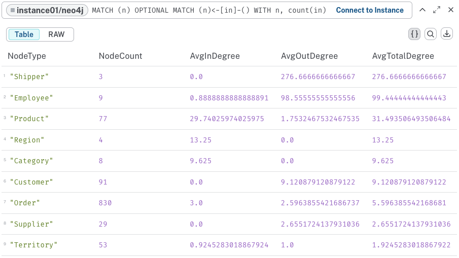

#  Node & Edge Metrics


Node & Edge Metrics quantify the basic structural properties of individual nodes and connections in a graph, such as how many connections a node has or how strong those connections are.

- **Node Degree**: Number of connections
- **Edge Weight**: Connection strength/importance
- **Density**: Ratio of actual vs possible connections

Let's work on the northwind dataset on Aura

https://github.com/neo4j-graph-examples/northwind

## First how to get the nodes and relationships for a graph

using `labels(n)` returns the nodes names

and `keys(n)` to get the properties

```cypher
MATCH (n)
RETURN DISTINCT labels(n) AS labels, keys(n) AS properties, COUNT(*) AS count
```

and the relationships

using `type(r)` returns the relationships name (relationshipType)

```cypher
MATCH ()-[r]->()
RETURN DISTINCT type(r) AS relationshipType, keys(r) AS properties, COUNT(*) AS count
```

## Node degrees

### In degree


Simple in-degree count for all nodes

```cypher
MATCH (n)
OPTIONAL MATCH (n)<-[r]-()
WITH n, count(r) as inDegree, labels(n)[0] as NodeType
RETURN
    NodeType,
    avg(inDegree) as AvgInDegree,
    count(n) as NodeCount
ORDER BY AvgInDegree DESC;
```

Now if we want to see more details about each node (no grouping)

```cypher
MATCH (n)
OPTIONAL MATCH (n)<-[r]-()
WITH n, count(r) as inDegree, labels(n)[0] as NodeType
RETURN
    NodeType,
    CASE NodeType
        WHEN 'Product' THEN n.productName
        WHEN 'Customer' THEN n.companyName
        WHEN 'Employee' THEN n.firstName + ' ' + n.lastName
        ELSE toString(id(n))
    END as NodeIdentifier,
    inDegree
ORDER BY inDegree DESC;
```

and if we want to see a break down by relationship types

```cypher
MATCH (n)<-[r]-()
RETURN
    labels(n)[0] as NodeType,
    type(r) as RelationType,
    count(r) as IncomingRelationships
ORDER BY NodeType, IncomingRelationships DESC;
```

### Out degree

Same for out degree

Your turn to write the query

[solution]

### Both in and out and total degree

```cypher
MATCH (n)
OPTIONAL MATCH (n)<-[in]-()
WITH n, count(in) as inDegree
OPTIONAL MATCH (n)-[out]->()
WITH n, inDegree, count(out) as outDegree
RETURN
    labels(n)[0] as NodeType,
    count(*) as NodeCount,
    avg(inDegree) as AvgInDegree,
    avg(outDegree) as AvgOutDegree,
    avg(inDegree + outDegree) as AvgTotalDegree
ORDER BY AvgTotalDegree DESC;
```


which returns



### Conclusion

Looking at the degree statistics from the Northwind dataset, we can draw several interesting insights:

1. Highest Impact Nodes:
   - Shippers have the highest average total degree (276.67), entirely from outbound connections (SHIPS relationships)
   - Makes sense as each shipper handles many orders in a business
   - Only 3 shipping companies but they're extremely well-connected

2. Key Employees:
   - Second highest total degree (99.44)
   - High outbound connections (98.56) showing they SELL many orders
   - Small inbound degree (0.89) likely from REPORTS_TO relationships
   - Shows employees are major hubs in the business network

3. Product Relationships:
   - Interesting balance: high inbound (29.74) vs low outbound (1.75)
   - High inbound likely from ORDERS relationships
   - Lower outbound probably from PART_OF category and FREQUENTLY_BOUGHT_WITH relationships
   - Products are heavily ordered but have fewer structural connections

4. Business Core (Orders):
   - Moderate total degree (5.60)
   - Balanced between in/out degrees (3.0 in, 2.60 out)
   - Central to the data model but not overwhelmingly connected

5. Support Nodes:
   - Region, Category: Only inbound connections
   - Customers, Suppliers: Only outbound connections
   - Shows clear hierarchical structure in certain parts of the model

6. Territories:
   - Most balanced in/out ratio (0.92 in, 1.0 out)
   - Lowest total degree (1.92)
   - Suggests territories are connecting nodes rather than major hubs

This degree analysis reveals the operational structure of the business:

- Few but highly connected shippers
- Employees as key operational hubs
- Products as main transaction targets
- Clear hierarchical structures in supporting entities

## Edge / relationships weights

### SIMPLEST - Count of each relationship type

```cypher
MATCH ()-[r]->()
RETURN type(r) as relationship_type,
       count(r) as weight
ORDER BY weight DESC;
```


### GROUPED - Count relationships between specific node types

```cypher
MATCH (start)-[r]->(end)
RETURN labels(start)[0] as start_type,
       type(r) as relationship_type,
       labels(end)[0] as end_type,
       count(r) as weight
ORDER BY weight DESC;
```

### ADVANCED - Connection strength between nodes

```cypher
MATCH (start)-[r]->(end)
WITH labels(start)[0] as start_type,
     labels(end)[0] as end_type,
     type(r) as relationship_type,
     count(r) as total_connections,
     // Count distinct start nodes
     count(DISTINCT start) as unique_starts,
     // Count distinct end nodes
     count(DISTINCT end) as unique_ends
RETURN start_type,
       relationship_type,
       end_type,
       total_connections,
       unique_starts,
       unique_ends,
       round(total_connections * 1.0 / unique_starts, 2) as avg_outgoing_per_start,
       round(total_connections * 1.0 / unique_ends, 2) as avg_incoming_per_end
ORDER BY total_connections DESC;
```

### COMPLEX - Relationship density and distribution

```cypher
MATCH (start)-[r]->(end)
WITH labels(start)[0] as start_type,
     labels(end)[0] as end_type,
     type(r) as relationship_type,
     count(r) as total_count
MATCH (potential_start)
WHERE labels(potential_start)[0] = start_type
WITH start_type, end_type, relationship_type, total_count,
     count(potential_start) as possible_starts
MATCH (potential_end)
WHERE labels(potential_end)[0] = end_type
WITH start_type, end_type, relationship_type,
     total_count, possible_starts,
     count(potential_end) as possible_ends,
     possible_starts * count(potential_end) as theoretical_max
RETURN start_type,
       relationship_type,
       end_type,
       total_count,
       theoretical_max,
       round(total_count * 100.0 / theoretical_max, 2) as connection_density
ORDER BY connection_density DESC;
```


### Conclusion for edge weights and network densities


Looking at the connection density results from Northwind, there are several interesting insights:

1. Highest Density Relationships:
   - Shipper-SHIPS-Order (33.33%): Each shipper handles about 1/3 of possible orders
   - Territory-IN_REGION-Region (25%): Good geographic distribution across regions
   - Shows efficient distribution of shipping workload and territorial organization

2. Mid-Range Densities:
   - Product-PART_OF-Category (12.5%): Products are well-distributed across categories
   - Employee-related relationships (SOLD, IN_TERRITORY, REPORTS_TO) all around 10%
   - Suggests balanced workload among employees

3. Low Density Relationships:
   - Order-ORDERS-Product (3.37%): Most orders don't contain every possible product
   - Supplier-SUPPLIES-Product (3.45%): Suppliers specialize in certain products
   - Customer-PURCHASED-Order (1.1%): Customers make selective purchases
   - These low densities are normal and expected in a business context

4. Interesting Special Case:
   - Product-FREQUENTLY_BOUGHT_WITH-Product (0.98%): Lowest density
   - Shows that only a small fraction of possible product pairs are frequently bought together
   - Could indicate opportunity for more cross-selling

Business Implications:

- Shipping workload is relatively evenly distributed
- Employee territories and reporting structure is well-balanced
- Supply chain is specialized rather than having suppliers provide everything
- Clear opportunities for increased cross-selling of products

