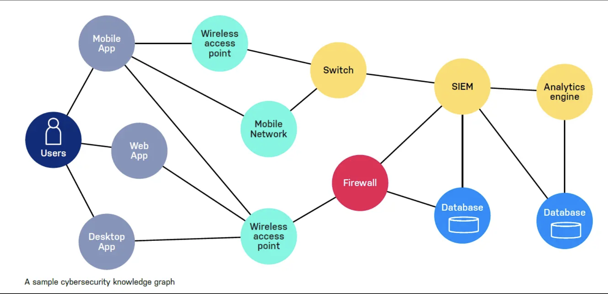
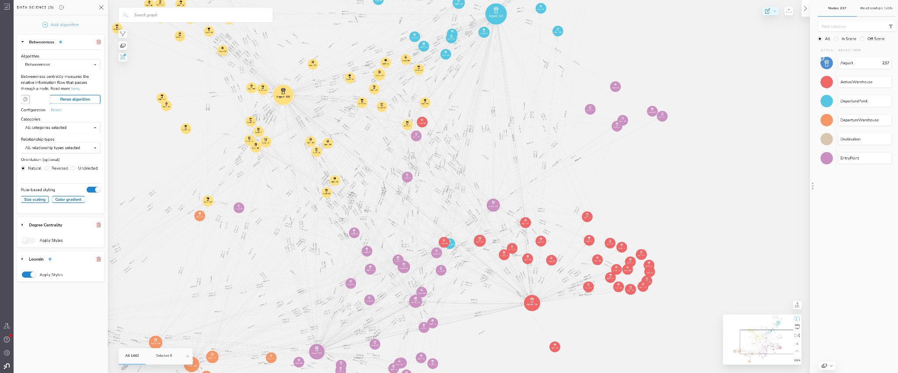
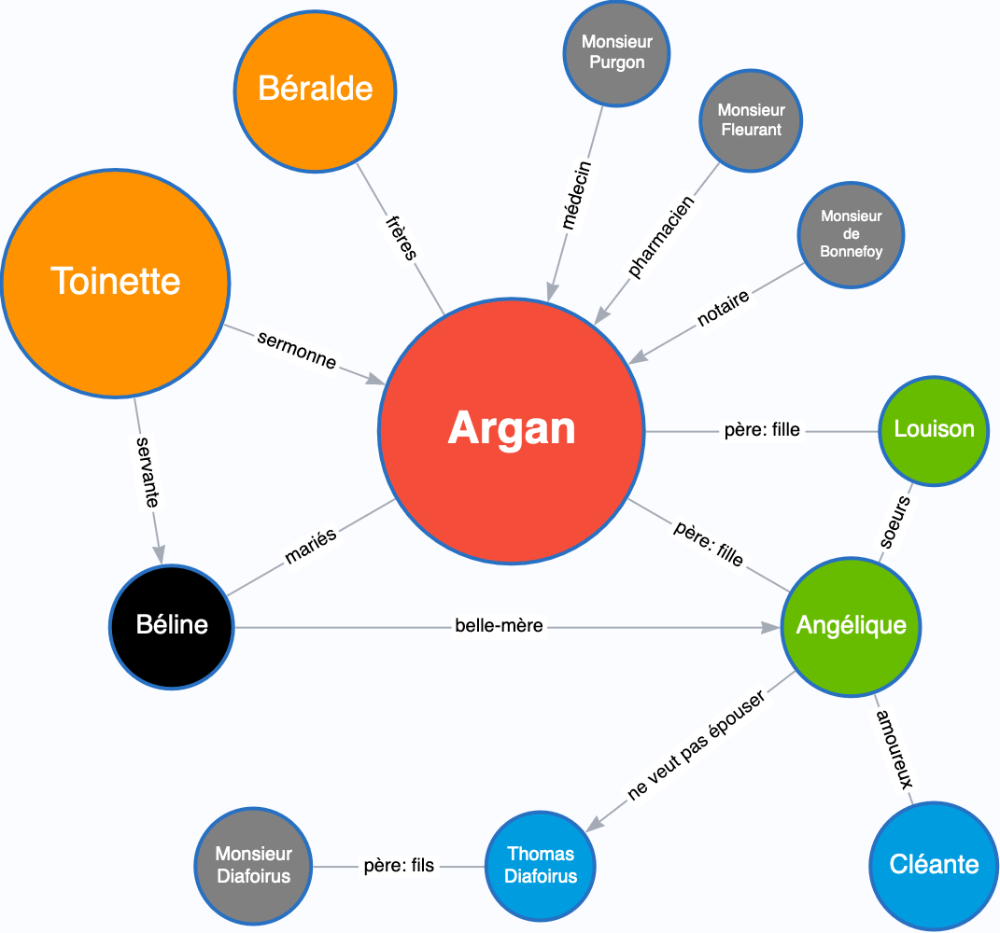
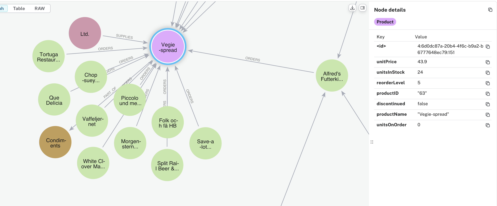
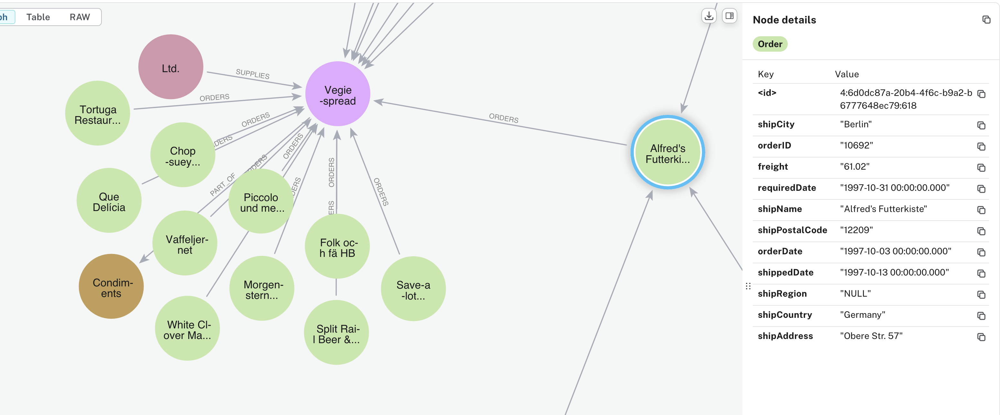

# Graph Data Modeling Fundamentals

## What are graph databases

A graph database is a NoSQL database that uses graph structures - nodes (entities), relationships (edges), and properties - to represent and store data.

A graph database emphasizes the **connections** between data elements, allowing for efficient traversal of relationships and complex query patterns that would be difficult in traditional relational databases.

Key characteristics:

- Native graph storage and processing
- Index-free adjacency (direct connections between nodes)
- ACID compliance in most implementations
- Optimized for highly connected data queries

Let's watch:

[](https://www.youtube.com/embed/T6L9EoBy8Zk)


See this intro from Graph Academy: [Graphs are everywhere](https://graphacademy.neo4j.com/courses/neo4j-fundamentals/1-graph-thinking/4-graphs-are-everywhere/)

Some key use cases of graph algorithms are


### Investigative journalism

The most prominent user of Neo4j for investigative journalism is the International Consortium of Investigative Journalists (ICIJ). One such graph that was created by the ICIJ was the Panama Papers. The purpose of this graph was to identify possible corruption based upon the relationships between people, companies, and most importantly financial institutions.


### Network and IT operations - cyber security

Companies use Neo4j to help them understand how information flows through a system and how components of a network are related. This is useful for planning, analysis of costs, and troubleshoot problems.


from https://v4.riino.site/blog/2022-08-08-Threat-Modeling-using-neo4j

- What is the most depended-upon component?


### Transportation and logistics


supply chain management. Entities that are modeled include raw suppliers, suppliers, products, wholesalers, and retailers. All of these entities are located somewhere and there is a distance between them that will impact how quickly products can be transported.


from https://neo4j.com/developer-blog/supply-chain-neo4j-gds-bloom/

- Who is the best wholesaler for each retailer based upon distance?
- Which raw supplier will give a particular retailer the freshest products?

### Theater

Relations between characters in a Moliere play


from https://moliere.love/le-malade-imaginaire/personnages/


### Use cases examples

You can find many other use cases https://neo4j.com/graphgists/ and  https://neo4j.com/use-cases/


## Neo4j Ecosystem


### Core Platform:

- Neo4j Graph Database (Community & Enterprise): The foundation - a native graph database that stores and processes connected data
- [Neo4j AuraDB](https://neo4j.com/product/auradb/): Fully managed cloud service that handles infrastructure, updates, and scaling automatically
- Neo4j Fabric: Enterprise feature enabling distributed graphs across multiple databases for scalability
- [Cypher](https://neo4j.com/docs/cypher-manual/current/introduction/): Declarative graph query language designed to be visual and intuitive, like ASCII art for queries

### Development Tools:

- [Neo4j Desktop](https://neo4j.com/download/): All-in-one development environment for local database management and project organization
- [Neo4j Browser](https://browser.neo4j.io/): Web-based interface for writing queries, visualizing results, and exploring your graph
- Neo4j Bloom: Business-friendly tool for visual graph exploration without writing queries
- [APOC library](https://neo4j.com/labs/apoc/): Swiss army knife of useful functions that extend Neo4j's capabilities
- [GDS (Graph Data Science)](https://neo4j.com/docs/graph-data-science/current/) library: Machine learning and graph algorithms for advanced analytics
- GraphQL integration: Enables GraphQL APIs on top of Neo4j for modern application development
- Official drivers: Native connectivity for major programming languages like Python, Java, JavaScript

### Key Companies/Partners:

- Neo4j, Inc.: The company behind Neo4j, providing enterprise support and development
- [GraphAcademy](https://graphacademy.neo4j.com): Free official learning platform with structured courses and certifications
- AWS, Google Cloud, Azure: Major cloud providers offering Neo4j as managed services

### Popular Tools from Community:

- [Arrows.app](https://arrows.app/): Free web-based tool for creating and sharing graph data models visually
- [neovis.js](https://github.com/neo4j-contrib/neovis.js/): JavaScript library for creating customizable graph visualizations in web applications
- [Neo4j ETL Tool](https://neo4j.com/labs/etl-tool/): Helps migrate data from relational databases to Neo4j
- [py2neo](https://neo4j.com/developer-blog/py2neo-v4-the-next-generation/): Popular Python library offering high-level functionality beyond the official driver


## Main Elements of Graph Models


- **Nodes** (vertices) represent entities
- **Relationships** (edges) represent connections

Then we add information through:

- **Labels** for categorizing nodes
- **Properties** on both nodes and relationships

And we add meaning to relationships with :

- **types** for categorizing connections
- **direction**

### Example the Northwind dataset

node: Product has multiple properties


relationship: ORDERS has properties: unitprice, quantity and discount


node: Order also has multiple properties


### Example : Paris Metro

- Stations are nodes
  - labels:
    - name
    - accessibility,
    - above / below ground
    - events related attributes
- between stations we have multiple types of relationships
  - BELONGS_TO_LINE
    - properties: line number, maintenance time, distance
  - PASSENGER_CONNECTS_TO
    - can be unidirectional or both ways
    - properties: distance, stairs, ...
  - CONNECTS_TO_LINE
    - properties: line number, ...

Relationship **types** (BELONGS_TO_LINE, PASSENGER_CONNECTS_TO, CONNECTS_TO_LINE) are verbs or verb phrases that describe the action, the connection between nodes. They define the semantic meaning of how nodes interact. Like verbs in sentences, they should be clear and specific about the nature of the relationship.

In cypher we can create a few nodes and relationships


```cypher
// Create Metro stations
CREATE (chatelet:Metro:RER {name: 'Châtelet', accessibility: true, underground: true})
CREATE (nation:Metro:RER {name: 'Nation', accessibility: true, underground: true})
CREATE (montparnasse:Metro {name: 'Montparnasse-Bienvenüe', accessibility: true, underground: true})
CREATE (defense:RER {name: 'La Défense', accessibility: true, underground: false})

// Create line relationships
CREATE (chatelet)-[:BELONG_TO_LINE {line: '1'}]->(nation)
CREATE (chatelet)-[:BELONG_TO_LINE {line: '4'}]->(montparnasse)

// Create station connections with distances (in meters)
CREATE (chatelet)-[:CONNECTS_TO_LINE {line: '1', distance: 450}]->(nation)
CREATE (nation)-[:CONNECTS_TO_LINE {line: '1', distance: 450}]->(chatelet)

// Create passenger connections (bidirectional implied by <->)
CREATE (chatelet)<-[:PASSENGER_CONNECTS_TO {distance: 150}]->(defense)
```

Note the way the directionality of the relation is created with simple arrows: `<- [] ->` or `- [] ->`

## Differences between properties and labels for nodes

Using the example of **metro stations as nodes** and **lines as relationships (edges)**, here’s how labels and properties differ:

**Labels**:

- Labels **categorize nodes**.
- A node can have **one or more labels** to signify its type or role.
- Example:
  - **Metro stations** might have the label `Metro`.
  - If some metro stations are also RER stops, they might have an additional label `RER`.

- Labels help you run queries like:

```cypher
MATCH (s:RER)
RETURN s.name
```

This query will return all nodes labeled `RER`.

**Properties**:

- Properties store **specific details or attributes** of a node (or relationship).
- A node can have multiple key-value pairs as properties.
- Properties provide **descriptive information** about the node.


Properties help you run queries like:

```cypher
MATCH (s:Metro)
WHERE s.zone = 1 AND 'M4' IN s.lines
RETURN s.name
```

This query finds all Metro stations in Zone 1 served by Line M4.

Labels are typically used to **group nodes** for broader queries, while properties are used to **filter specific nodes** based on detailed attributes.

- **Labels** classify nodes by their **type or role** (e.g., `Metro`, `RER`).
  - Built-in indexing
  - Fast for pattern matching
  - Used for broad categorization
  - Limited number per database
  - Better query performance

- **Properties** provide **details about individual nodes** (e.g., `name`, `zone`, `lines`).
  - Need explicit indexing
  - Store specific data values
  - Can have many per node
  - Can be updated frequently
  - More storage overhead


**Best Practice**:

Use labels for characteristics you frequently search or filter by, properties for specific attributes that vary between nodes.

**Bad Practice**:

Converting properties to labels like :Zone1, :HasElevator - this would bloat the label space and reduce performance.

Labels: few categories, properties : large space of key values

## Another example

Social network like X

Nodes: accounts

- labels: free, paying (certified)
- properties: account_name, photo, bio, etc

Relationship : FOLLOWS

- one direction
- properties: since, ...

Relationship : FOLLOWED_BY

- one direction
- properties: since, ...

Nodes : posts

- labels : Thread, Comment, Repost
- properties: content, likes, links, ...

relationships: LIKED_BY, REPOSTED_BY, FLAGGED_BY

## When to use a graph model

Choose a Relational Database (PostgreSQL) when:

The data is stable and its structure predictable. Relationships between entities are well-defined but not the primary focus of your queries.

The data schema is stable; data integrity is crucial; most queries involve joining a few tables in predictable ways. Transactions need ACID compliance. Relationships are  simple : belong, has one, has many.

Choose a Document Database (MongoDB) when:

The data is naturally hierarchical and self-contained, with frequent reads but relatively few joins needed.
Data structural changes are expected and schema flexibility is important.

Choose a Graph Database (Neo4j) when:

The value comes from the **relationships** between your data, especially when these relationships form complex patterns. Transportation networks, social networks are  a perfect example as  you often need to find paths between points. The strength of Graph Databases is in traversing relationships efficiently, especially when you don't know the depth of these relationships in advance (for instance: "find all stations reachable within 3 connections").


But all three types of database can co-exist to serve  an application. This is called **polyglot persistence**  where each type of data is stored in the most appropriate database model.

Using  Spotify as an example. You might use:

A relational database for user accounts, subscriptions, and play counts - data with clear structure and where ACID compliance matters for billing and usage tracking.

A document database for song and album information - each song document contains its metadata, lyrics, artist details, and album art. This information is usually accessed together and rarely needs complex joins.

A graph database for recommendations and music discovery - storing how songs relate to each other, what users listen to together, artist collaborations, and genre relationships. This allows complex queries like "find songs that fans of this artist also enjoy" or "discover similar artists through collaboration networks."


## Benefits of graph databases


### Natural Representation of connected data through relationships

Think about how we naturally describe relationships in the real world. When we talk about a metro system, we say things like "Châtelet connects to Les Halles" or "Line 1 runs through Bastille."

Graph databases mirror this natural way of thinking about connections.

In a graph, we can directly model these relationships: (Châtelet)-[:CONNECTS_TO]->(Les_Halles) or (Line_1)-[:RUNS_THROUGH]->(Bastille). This direct mapping between how we think and how we store data makes it easier to model complex domains and reason about our data.

These same relationships in relational databases would require complex join tables, in document databases nested arrays, neither of which reflects how we naturally think about these connections.

Graph databases use **index-free adjacency**: each node directly stores physical references to its adjacent nodes.

Traversing relationships comes down to following these references in memory, regardless of how many hops are needed.

### Flexibility in Schema Evolution

Graph database, like document database, provide schema flexibility.

In a graph database, you can add new types of nodes and relationships without affecting existing queries or data.

Let's say you're modeling the Paris Metro system. you start with metro stations and their connections. Later on, you can add bike parking spaces and their relationships to metro stations  without modifying any existing structures. Your queries for metro-only paths continue to work unchanged, while you can now also query for multi modal metro-bikes journeys.

This flexibility extends to properties as well. You can add new properties to certain nodes or relationships without having to modify all similar entities. For instance, if you decide to start tracking **accessibility** information for some stations, you can add those properties just to the relevant station nodes, without needing to update your entire database schema or deal with null values in a relational table.

### In short

- models relations more than spreadsheets
- super fast querying of relationships
- flexible schema

## Learn to speak cypher

Here's a cheatsheet

see neo4j_cheetsheet.md


