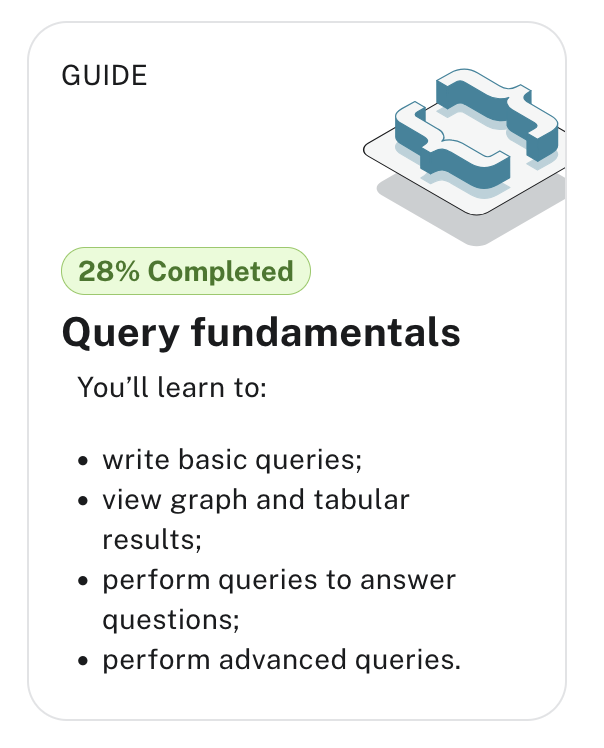

# Neo4j Practice

## Aura db

AuraDB offers fre eneo4j hosting.

Create account on https://neo4j.com/product/auradb/

and then create an instance.

Finally click on the "Learn" button upper right and Query fundamentals



### Northwind dataset

The **Northwind dataset** is a fictional trading company database originally created by Microsoft for SQL Server tutorials. It represents a small trading company that imports and exports specialty foods.

Key entities in the Northwind dataset include:

- Products: Specialty food items like beverages, condiments, and seafood
- Categories: Product groupings (e.g., Beverages, Confections, Dairy Products)
- Suppliers: Companies that provide the products
- Customers: Companies that buy the products
- Orders: Purchase transactions
- Employees: Staff members who handle orders
- Shippers: Companies that deliver the orders


The relationships between these entities demonstrate:

- One-to-many relationships (e.g., a Category contains multiple Products)
- Many-to-many relationships (e.g., Orders contain multiple Products, Products appear in multiple Orders)
- Self-referential relationships (e.g., Employees have a reporting structure)

so

click on the relationships to see how entities are linked together

IN_REGION: a territory belongs to a region
IN_TERRITORY: an employee is in a territory
product is part of a category
an order ORDERS (includes) products ? ORDERS has properties: unit price, quantity, discount
a customer PURCHASED orders
employees REPORT_TO employees
suppliers supplies products
an employee SOLD orders (try removing the limit 25, note that we do not see all the sales reps with limit 25)

who supplies prducts under 20$
out of stock products : unitsInStock
employees in a certain region (through territories)
who bought what ? products bought by a customer


- Import data Northwind dataset > run import
  - csv files: territories, suppliers, regions, shippers, products, categories, and relations
  - explore results

Go to Query and click on db icon:

Nodes (1,104), Relationships (4,909), Property keys


- A node can have multiple labels and the list shows all labels in the database.
- Relationships on the other hand, can have only one type, but multiple relationships can exist between the same nodes.


click on one of the node  `MATCH (n:Product) RETURN n LIMIT 25;`

Think of it like asking: "Show me up to 25 products in the database."

MATCH (n:Product) - Find all nodes with the label "Product" and refer to each as "n"
RETURN n - Send back those nodes
LIMIT 25 - Show only the first 25 results


click on one of the relation ship  `MATCH p=()-[:ORDERS]->() RETURN p LIMIT 25;`

MATCH p=()-[:ORDERS]->() - Find any nodes connected by an ORDERS relationship (direction right) and call the entire path "p"
RETURN p - Return these paths
LIMIT 25 - Show only first 25 results

The empty parentheses () are wildcards, meaning "any node." In Northwind, this shows customers or employees who ordered products.


Next

MATCH path=(:Product)-[:PART_OF]->(c:Category)
WHERE c.categoryName = 'Produce'
RETURN path;

this shows all produce products and their category connection

MATCH path=(:Product)-[:PART_OF]->(c:Category) - Find all Products connected to Categories via PART_OF relationship
WHERE c.categoryName = 'Produce' - Filter to only show Categories named "Produce"
RETURN path - Show these paths


### Cypher queries

A basic Cypher query follows this structure:

`MATCH [pattern]` - Define what to find in the graph
`WHERE [conditions]` - Optional: Filter the results
`RETURN [what to show]` - Specify output
`LIMIT [number]` - Optional: Restrict number of results

Example:

```cypher
MATCH (p:Person)-[:LIVES_IN]->(c:City)
WHERE c.name = "Paris"
RETURN p.name, c.name
LIMIT 10
```

or

MATCH (p:Product)-[:PART_OF]->(c:Category)
WHERE p.unitPrice > 50
RETURN p.productName, c.categoryName
LIMIT 10


or

```cypher
MATCH (e:Employee)-[:REPORTS_TO]->(m:Employee)
WHERE m.lastName = "Fuller"
RETURN e.firstName, m.lastName
LIMIT 10
```


This finds employees who report to Fuller in the Northwind organizational structure.


A **MATCH pattern** has three key components:

1. Nodes: In parentheses ()
   - With labels: (p:Person)
   - Properties: (p:Person {name: "John"})
   - Anonymous: ()

2. Relationships: In square brackets []
   - With types: -[:KNOWS]->
   - Direction: -> or <-
   - Anonymous: --

3. Variables: For referencing
   - Node variables: (p:Person)
   - Relationship variables: -[r:KNOWS]->
   - Path variables: path=()-->()


click on one of the property keys

```
MATCH (n)
WHERE n.description IS NOT NULL
RETURN DISTINCT "node" as entity, n.description AS description LIMIT 25
UNION ALL
MATCH ()-[r]-()
WHERE r.description IS NOT NULL
RETURN DISTINCT "relationship" AS entity, r.description AS description LIMIT 25;
```

### View the schema

CALL db.schema.visualization()

### Practice

see northwind-practice.cypher

[CHECK] group by and counts is weird


### Similarity


which product categories are typically co-ordered with other product categories and how frequently.

use the


```js
// which categories are the products of an order in
MATCH (o:Order)-[:ORDERS]->(:Product)-[:PART_OF]->(c:Category)
// retain same ordering of categories
WITH o, c ORDER BY c.categoryName
// aggregate categories by order into a list of names
WITH o, collect(DISTINCT c.categoryName) as categories
// only orders with more than one category
WHERE size(categories) > 1
// count how frequently the pairings occur
RETURN categories, count(*) as freq
// order by frequency
ORDER BY freq DESC
LIMIT 50
```

and then

```js
// pattern from customer purchasing products to another customer purchasing the same products
MATCH (c:Customer)-[:PURCHASED]->(:Order)-[:ORDERS]->(p:Product)<-[:ORDERS]-(:Order)<-[:PURCHASED]-(c2:Customer)
// don't want the same customer pair twice
WHERE c < c2
// sort by the top-occuring products
WITH c, c2, p, count(*) as productOccurrence
ORDER BY productOccurrence DESC
// return customer pairs ranked by similarity and the top 5 products
RETURN c.companyName, c2.companyName, sum(productOccurrence) as similarity, collect(distinct p.productName)[0..5] as topProducts
ORDER BY similarity DESC LIMIT 10
```


```js
MATCH (c:Customer)-[:PURCHASED]->(:Order)-[:ORDERS]->(p:Product)<-[:ORDERS]-(:Order)<-[:PURCHASED]-(c2:Customer)
WHERE c < c2
// find similar customers
WITH c, c2, count(*) as similarity
// with at least 50 shared product purchases
WHERE similarity > 50
// create a relationship between the two without specifying direction
MERGE (c)-[sim:SIMILAR_TO]-(c2)
// set relationship weight from similairity
ON CREATE SET sim.weight = similarity
```

Pattern to create relation

```js
MATCH <source to target relation>
WITH source, target, some way of counting
WHERE define threshold or some filtering
MERGE (source)<->r:VERB</-/>(target)
SET r.<property name> = <property value>
```


### Reset data

[TODO] before: how to delete the Northwind dataset

Before importing the new dataset

you can remove all the nodes of the northwind data with

```js
MATCH (n)
DETACH DELETE n
```

but that does not remove the nodes from the database visualization.

Alternative: go to  <https://console.neo4j.io> and ddelete the instance or create a new one


### Shortest path algorithm

https://neo4j.com/blog/graph-algorithms-neo4j-shortest-path/

Edsger Dijkstra
https://en.wikipedia.org/wiki/Dijkstra%27s_algorithm

The algorithm uses a min-priority queue data structure for selecting the shortest paths known so far. Before more advanced priority queue structures were discovered, Dijkstra's original algorithm ran in Θ ( | V | 2 ) {\displaystyle \Theta (|V|^{2})} time, where | V | {\displaystyle |V|} is the number of nodes.

These algorithms start at a node and expand relationships until the destination has been reached. Pathfinding algorithms do this while trying to find the cheapest path in terms of number of hops or weight whereas search algorithms will find a path that might not be the shortest.


## Stack Overflow - social analysis

- How you can model social data as graphs
- How to query the graph and answer questions using Cypher
- How to use **shortest path algorithm** to understand relationships


The model contains data about users' questions, answers, and comments about Neo4j and Cypher.
Nodes represent:

Users
Questions
Answers
Comments
Tags


The relationships between these nodes show:

What UserASKED a Question
What UserPROVIDED an Answer
What UserCOMMENTED to a Comment
What AnswerANSWERED a Question
What Comment is COMMENTED_ON a Question
What Question is TAGGED with a Tag


Start by showing all the users who ASKED a question

MATCH (u:User)-[a:ASKED]->(q:Question)
RETURN u,a,q


compare with all the users who provided an answer

MATCH (u:User)-[p:PROVIDED]->(a:Answer)
RETURN u,p,a

What's the obvious observation ?


MATCH (u:User)-[a:ASKED]->(q:Question)
RETURN u,a,q

Combine with OPTIONAL MATCH to handle cases where a user might have only questions or only answers:


MATCH (u:User)
MATCH (u)-[a:ASKED]->(q:Question)
MATCH (u)-[p:PROVIDED]->(ans:Answer)
RETURN u.name, collect(DISTINCT q) as questions, collect(DISTINCT ans) as answers

MATCH (u:User)
OPTIONAL MATCH (u)-[a:ASKED]->(q:Question)
OPTIONAL MATCH (u)-[p:PROVIDED]->(ans:Answer)
RETURN u.name, collect(DISTINCT q.title) as questions, collect(DISTINCT ans.title) as answers


MATCH (u:User)
OPTIONAL MATCH (u)-[a:ASKED]->(q:Question)
OPTIONAL MATCH (u)-[p:PROVIDED]->(ans:Answer)
RETURN count(*) as totalUsers, u.id, u.name, count(q) as q_num, count(ans) as a_num


And counting questions

MATCH (u:User)
OPTIONAL MATCH (u)-[:ASKED]->(q:Question)
OPTIONAL MATCH (u)-[:PROVIDED]->(a:Answer)
WITH u,
     CASE WHEN count(DISTINCT q) > 0 THEN 1 ELSE 0 END as hasQuestions,
     CASE WHEN count(DISTINCT a) > 0 THEN 1 ELSE 0 END as hasAnswers
RETURN
    count(*) as totalUsers,
    sum(hasQuestions) as usersWithQuestions,
    sum(hasAnswers) as usersWithAnswers,
    sum(CASE WHEN hasQuestions=1 AND hasAnswers=1 THEN 1 ELSE 0 END) as usersWithBoth


Can you complete this query to use the COMMENTED relationship to find the users who commented the most?
Replace the `?’s to complete the query

MATCH (u:User)-[:?????????]->(c:Comment)
RETURN u.display_name, COUNT(?) AS comments
ORDER BY ???????? DESC
LIMIT 10

MATCH (u:User)-[:COMMENTED]->(c:Comment)
RETURN u.display_name, COUNT(c) AS comments
ORDER BY comments DESC
LIMIT 10

Shortest path: from one user to the other
not super interesting but doable, illustrative

## Crime Investigation - Pole dataset

- How crime data can be modelled in a graph
- How to query the graph and answer questions using Cypher
- How to refactor your data
- How to use spatial and aggregation functions in Cypher
- How to use the built-in Cypher function shortest path
- How to do conditional matches using the WHERE clause


call db.schema.visualisation()

11 node types
with Person has many relationships ot itself


    What type of crimes were committed?
    What is the most common crime?
    What location has the highest crime rate?

MATCH (c:Crime)
RETURN labels(c), count(c) AS total

Counts number of crime

Different types of crimes
MATCH (c:Crime)
RETURN labels(c), count(c) AS total

labels aggregates all the labels of the node

group by type


MATCH (c:Crime)
RETURN c.type AS crime_type, count (c) AS total
ORDER BY count(c) DESC

Objects involved in ccrime (as evidence)

MATCH (o:Object)-[:INVOLVED_IN]->(c:Crime)
RETURN c.type AS crime_type, count(c) AS total, o.description AS object
ORDER BY count(c) DESC

Persons involved in crimes

MATCH (p:Person)-[:PARTY_TO]->(c:Crime)
RETURN c.type AS crime_type, count(c) AS total, p.name AS name
ORDER BY count(c) DESC

### Location to Point


The point data type allows you to use location based functions in Cypher. Data Importer doesn’t support natively creating point data types. In order to work with locations in the POLE dataset, you need to create a point property on the Location nodes. Currently the Location nodes have a latitude and longitude property and you can use these to create a point property.


MATCH (l:Location)
SET l.position = point({latitude: l.latitude, longitude: l.longitude})


Top 20 locations for crime

MATCH (l:Location)<-[:OCCURRED_AT]-(:Crime)
RETURN l.address AS locale, l.postcode AS postcode, count(l) AS total
ORDER BY count(l) DESC
LIMIT 20

### Geospatial


find out how much and what types of crime were committed in the vicinity of one address.

- define set the address

MATCH (l:Location {address: '1 Coronation Street'})
RETURN l.position AS corrie

-  locate where the crimes were committed and calculate the distance to Coronation Street

MATCH (l:Location {address: '1 Coronation Street'})
WITH l.position AS corrie
MATCH (x:Location)<-[:OCCURRED_AT]-(c:Crime)
RETURN x.address as crime_location,
    point.distance(x.position, corrie) AS distanceFromCoronationSt

point.distance()

-  filter the results : within 500 meters

MATCH (l:Location {address: '1 Coronation Street'})
WITH l.position AS corrie
MATCH (x:Location)<-[:OCCURRED_AT]-(c:Crime)
WITH x, c, point.distance(x.position, corrie) AS distance
WHERE distance < 500
RETURN x.address AS address, count(c) AS crime_total, collect(c.type) AS crime_type, distance
ORDER BY distance desc
limit 10


collect() : list all types,

### Spatial Cypher Functions

https://lyonwj.com/blog/making-sense-of-geospatial-data-with-knowledge-graphs-neo4j


 point() - for creating Point instances
 point.distance() - calculates distance between two points. Can also be used for radius distance search when used in a WHERE predicate
 point.withinBBox() - to find points within a given bounding box


RETURN point(
  {latitude:49.38713, longitude:12.12711}
)


## Basics

Graph elements

https://graphacademy.neo4j.com/courses/neo4j-fundamentals/1-graph-thinking/2-graph-elements/

Relationships are typically verbs.

We could use a relationship to represent a personal or professional connection (Person knows Person, Person married to Person), to state a fact (Person lives in Location, Person owns Car, Person rated Movie), or even to represent a hierarchy (Parent parent of Child, Software depends on Library).

Directed vs. undirected graphs
Michael and Sarah are married to each other

In an undirected graph, relationships are considered to be bi-directional or symmetric.

Weighted vs. unweighted graphs

More complex shortest path algorithms (for example, Dijkstra’s algorithm or A* search algorithm) take a weighting property on the relationship into account when calculating the shortest path. Say we have to send a package using an international courier, we may prefer to send the package by air so it arrives quickly, in which case the weighting we would take into account is the time it takes to get from one point to the next.


centrality in transport networks

shortest path: p105

https://github.com/jbarrasa/gc-2022/tree/main/interop/data


## Data

### IDFM gtfs

https://data.iledefrance-mobilites.fr/explore/dataset/traces-des-lignes-de-transport-en-commun-idfm/information/?disjunctive.route_type


###  Velib

https://velib-metropole-opendata.smovengo.cloud/opendata/Velib_Metropole/station_information.json

### Github
Multiple datasets

https://github.com/neo4j-graph-examples

https://github.com/neo4j-graph-examples/entity-resolution

### Benchmark datasets for entity resolution


https://dbs.uni-leipzig.de/research/projects/benchmark-datasets-for-entity-resolution

## Import data

see tutorial

Nothing complex
The csv must be compliant
upload csv files
create node, add name, set ids, data types and properties
Drag + to create relationships, add file, set properties
Import data


## hosted

https://neo4j.com/product/auradb/
