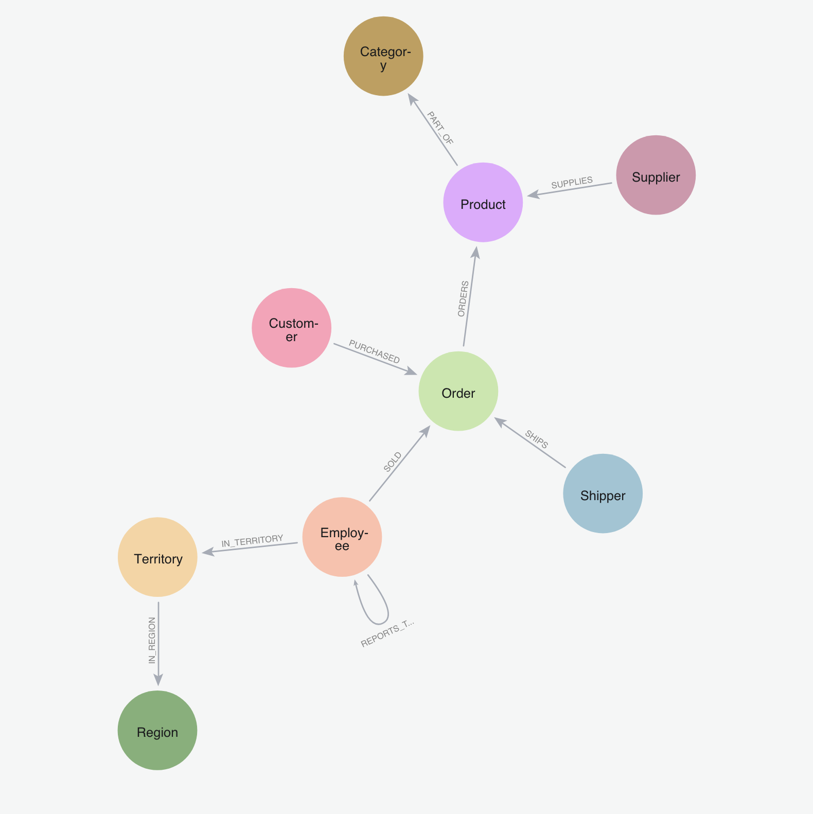

# Neo4j Practice

## Aura db

AuraDB offers fre eneo4j hosting.

Create account on https://neo4j.com/product/auradb/

and then create an instance.

Finally click on the "Learn" button upper right and Query fundamentals

<div style='display: left; margin-left: 30px; '>

</div>


## Northwind dataset schema

The **Northwind dataset** is a fictional trading company database originally created by Microsoft for SQL Server tutorials. It represents a small trading company that imports and exports specialty foods.

Key entities in the Northwind dataset include:

- **Products**: Specialty food items like beverages, condiments, and seafood
- **Categories**: Product groupings (e.g., Beverages, Confections, Dairy Products)
- **Suppliers**: Companies that provide the products
- **Customers**: Companies that buy the products
- **Orders**: Purchase transactions
- **Employees**: Staff members who handle orders
- **Shippers**: Companies that deliver the orders


The relationships between these entities demonstrate:

- One-to-many relationships (e.g., a Category contains multiple Products)
- Many-to-many relationships (e.g., Orders contain multiple Products, Products appear in multiple Orders)
- Self-referential relationships (e.g., Employees have a reporting structure)

The **relationships** are defined as

- IN_REGION: a territory belongs to a region
- IN_TERRITORY: an employee is in a territory
- product is PART_OF a category
- an order ORDERS (includes) products
  - note that the relationship ORDERS has properties: unit price, quantity, discount
- a customer PURCHASED orders
- suppliers SUPPLIES products
- employees REPORT_TO employees
- an employee SOLD orders



## Explore


<div style='display: left; margin-left: 30px; '>

</div>


- Click on the PURCHASED relations and notice the query

```cypher
MATCH p=()-[:PURCHASED]->() RETURN p LIMIT 25;
```

Edit the query and remove the LIMIT 25 to see the whole graph with the PURCHASED relationship

- Click on a Product node in the sidebar and then on one of the nodes in the graph

Note the cypher query

```cypher
MATCH (n:Product) RETURN n LIMIT 25;
```

<div style='display: left; margin-left: 30px; '>

</div>


- find all the orders for all customers

A customer -  purchased -> orders


so the cypher is

```cypher
MATCH path=(c:Customer)-[pr:PURCHASED]->(o:Order) RETURN path LIMIT 25;
```

If you don't want the graph but want to return the table instead, just return the entities and relations that you need from the query.

For instance if we want to return the customer's contactName and companyName, the order's orderID and shipName, the query becomes

```cypher
MATCH (c:Customer)-[pr:PURCHASED]->(o:Order) RETURN c.contactName, c.companyName, o.orderID, o.shipName LIMIT 25;
```

and you get the table


<div style='display: left; margin-left: 30px; '>

</div>


## Cypher query syntax

A basic Cypher query follows this structure:

`MATCH [pattern]` - Define what to find in the graph
`WHERE [conditions]` - Optional: Filter the results
`RETURN [what to show]` - Specify output
`LIMIT [number]` - Optional: Restrict number of results

A **MATCH pattern** has three key components:

1. **Nodes**: In parentheses ()
   - With labels: (p:Person)
   - Properties: (p:Person {name: "John"})
   - Anonymous: ()

2. **Relationships**: In square brackets []
   - With types: -[:KNOWS]->
   - Direction: -> or <-
   - Anonymous: --

3. **Variables**: For referencing
   - Node variables: (p:Person)
   - Relationship variables: -[r:KNOWS]->
   - Path variables: path=()-->()


Filtering, ordering, limiting, coalescing, ... in cypher with the MATCH clause, is not that different from regular SQL queries syntax .

See the cheat sheet for the MATCH clause docs/cypher-match-cheatsheet.md

### You can see the whole model schema with

```cypher
CALL db.schema.visualization()
```

## Your turn

The relations:

- Product PART_OF Category
- Suppliers :SUPPLIES Products
- Supplier SUPPLIES Product PART_OF Category
- Order :ORDERS Product

Write the following queries for graph and tables

- all products over $50
- which products are seafood,
  - return product name and price
  - display the graph
- Who supplies seafood product
  - return productName, unitPrice, companyName, country


### returning more entities

this returns the graph of suppliers who supply product > $50 and their categories.


```cypher
MATCH path=(s:Supplier)-[:SUPPLIES]->(p:Product)-[:PART_OF]->(c:Category)
WHERE p.unitPrice > 50
RETURN path
```

What if we also want to see the orders for these products ?

Using `WITH`

```cypher
MATCH path=(s:Supplier)-[:SUPPLIES]->(p:Product)-[:PART_OF]->(c:Category)
WHERE p.unitPrice > 50
WITH path, p
MATCH orderPath=(o:Order)-[: ORDERS ]->(p)
RETURN path, orderPath
```

this returns the first graph of suppliers, products and their categories.
But also the orders for these products.

### Back to practicing

- Which categories have the most expensive products?
  - use `max(p.unitPrice) AS maxPrice`

- Find all orders shipped to London
- find all the products shipped to London
- Who are our top 5 customers by number of orders?

### Optional MATCH


OPTIONAL MATCH works like a regular MATCH but when no matching relationships/patterns are found, it returns NULL instead of filtering out the record.

This Returns ALL products with their orders (if they exist)


```cypher
MATCH (p:Product)
WHERE p.productName = 'Chai'
OPTIONAL MATCH (p)<-[o:ORDERS]-()
RETURN p.productName, o;
```


Will show:

- Product1, order_relationship1
- Product1, order_relationship2
- Product2, order_relationship3
- Product3, NULL  // Product with no orders
- Product4, order_relationship5

OPTIONAL MATCH is like a LEFT JOIN in SQL : it keeps records from the left side (Products) even when there's no match on the right side (Orders).


So for instance looking at order counts

```cypher
MATCH (p:Product)
WHERE p.produtName = "Aniseed Syrup"
OPTIONAL MATCH (p)<-[o:ORDERS]-()
RETURN p.productName,
       COUNT(o) as order_count;
```

### Property Filters

These queries are equivalent and provide the same results.


```cypher
MATCH (o:Order)-[:ORDERS]->(p:Product)
WHERE o.shipCity = 'London'
RETURN o.orderID, o.shipDate, p.productName, p.unitPrice
```

property pattern:

```cypher
MATCH (o:Order { shipCity : 'London' })-[:ORDERS]->(p:Product)
RETURN o.orderID, o.shipDate, p.productName, p.unitPrice
```

The property pattern is slightly more performant as it filters earlier in the query execution. However, WHERE clauses offer more flexibility for complex conditions.

### Back to you

- find all the employees reporting to mr / mrs 'Fuller'

- which product categories each supplier provides ?
  - you can omit the relations between entities
  - (s:Supplier)-->(:Product)-->(c:Category)

```cypher
MATCH (s:Supplier)-->(:Product)-->(c:Category)
RETURN s.companyName AS company, collect( DISTINCT c.categoryName) AS categories
```

## Create new relationships with MERGE


The pattern to create relationship VERB with properties

```js
MATCH <source to target relation>
WITH source, target, some way of counting
WHERE define threshold or some filtering
MERGE (source)<->r:VERB</-/>(target)
SET r.<property name> = <property value>
```


Let's create new relationships :  `FREQUENTLY_BOUGHT_WITH`: as in belong to the same order

Notice how you can point back to the product through the order.

First we find all the products that often (freq > 10) bought together.

```cypher
MATCH (p1:Product)<-[:ORDERS]-(Order)-[:ORDERS]->(p2:Product)
WHERE p1 < p2
WITH p1, p2, count(*) AS frequency
WHERE frequency > 3
return p1.productName, p2.productName, frequency
ORDER BY frequency desc
```

Let's use the results of that query to create a new relation called `FREQUENTLY_BOUGHT_WITH`
and add the property weight = frequency

We do not specify any arrows which makes the relation bidirectional

```cypher
MATCH (p1:Product)<-[:ORDERS]-(Order)-[:ORDERS]->(p2:Product)
WHERE p1 < p2
WITH p1, p2, count(*) AS frequency
WHERE frequency > 3
MERGE (p1)-[r:FREQUENTLY_BOUGHT_WITH]-(p2)
 SET r.weight= frequency
```

We see : Created 58 relationships, set 58 properties

now we can visualize the products using this relation


```cypher
MATCH p=()-[:FREQUENTLY_BOUGHT_WITH]->() RETURN p
```

### Your turn to create a new relationship

create new relations

- Employee to Employee (worked together)
  - as in employees who PROCESSED the same orders


### Other example


```js
MATCH (c:Customer)-[:PURCHASED]->(:Order)-[:ORDERS]->(p:Product)<-[:ORDERS]-(:Order)<-[:PURCHASED]-(c2:Customer)
WHERE c < c2
// find similar customers
WITH c, c2, count(*) as similarity
// with at least 50 shared product purchases
WHERE similarity > 50
// create a relationship between the two without specifying direction
MERGE (c)-[sim:SIMILAR_TO]-(c2)
// set relationship weight from similairity
ON CREATE SET sim.weight = similarity
```


### Reset data

Before importing the new dataset

you can remove all the nodes of the northwind data with

```js
MATCH (n)
DETACH DELETE n
```

but that does not remove the nodes from the database visualization.

Alternative: go to  <https://console.neo4j.io> and delete the instance or create a new one


## Stack Overflow - social analysis

- How you can model social data as graphs
- How to query the graph and answer questions using Cypher
- How to use **shortest path algorithm** to understand relationships


The model contains data about users' questions, answers, and comments about Neo4j and Cypher.
Nodes represent:

- Users
- Questions
- Answers
- Comments
- Tags


The relationships between these nodes show:

- What UserASKED a Question
- What UserPROVIDED an Answer
- What UserCOMMENTED to a Comment
- What AnswerANSWERED a Question
- What Comment is COMMENTED_ON a Question
- What Question is TAGGED with a Tag

Start by showing all the users who ASKED a question

```cypher
MATCH (u:User)-[a:ASKED]->(q:Question)
RETURN u,a,q
```

compare with all the users who provided an answer

```cypher
MATCH (u:User)-[p:PROVIDED]->(a:Answer)
RETURN u,p,a
```

What's the obvious observation ?


```cypher
MATCH (u:User)-[a:ASKED]->(q:Question)
RETURN u,a,q
```

Combine with OPTIONAL MATCH to handle cases where a user might have only questions or only answers:


```cypher
MATCH (u:User)
MATCH (u)-[a:ASKED]->(q:Question)
MATCH (u)-[p:PROVIDED]->(ans:Answer)
RETURN u.name, collect(DISTINCT q) as questions, collect(DISTINCT ans) as answers
```


```cypher
MATCH (u:User)
OPTIONAL MATCH (u)-[a:ASKED]->(q:Question)
OPTIONAL MATCH (u)-[p:PROVIDED]->(ans:Answer)
RETURN u.name, collect(DISTINCT q.title) as questions, collect(DISTINCT ans.title) as answers
```


```cypher
MATCH (u:User)
OPTIONAL MATCH (u)-[a:ASKED]->(q:Question)
OPTIONAL MATCH (u)-[p:PROVIDED]->(ans:Answer)
RETURN count(*) as totalUsers, u.id, u.name, count(q) as q_num, count(ans) as a_num
```


And counting questions

```cypher
MATCH (u:User)
OPTIONAL MATCH (u)-[:ASKED]->(q:Question)
OPTIONAL MATCH (u)-[:PROVIDED]->(a:Answer)
WITH u,
     CASE WHEN count(DISTINCT q) > 0 THEN 1 ELSE 0 END as hasQuestions,
     CASE WHEN count(DISTINCT a) > 0 THEN 1 ELSE 0 END as hasAnswers
RETURN
    count(*) as totalUsers,
    sum(hasQuestions) as usersWithQuestions,
    sum(hasAnswers) as usersWithAnswers,
    sum(CASE WHEN hasQuestions=1 AND hasAnswers=1 THEN 1 ELSE 0 END) as usersWithBoth
```


Can you complete this query to use the COMMENTED relationship to find the users who commented the most?
Replace the `?’s to complete the query

MATCH (u:User)-[:?????????]->(c:Comment)
RETURN u.display_name, COUNT(?) AS comments
ORDER BY ???????? DESC
LIMIT 10

MATCH (u:User)-[:COMMENTED]->(c:Comment)
RETURN u.display_name, COUNT(c) AS comments
ORDER BY comments DESC
LIMIT 10

Shortest path: from one user to the other
not super interesting but doable, illustrative


### Shortest path algorithm

https://neo4j.com/blog/graph-algorithms-neo4j-shortest-path/

Edsger Dijkstra
https://en.wikipedia.org/wiki/Dijkstra%27s_algorithm

The algorithm uses a min-priority queue data structure for selecting the shortest paths known so far. Before more advanced priority queue structures were discovered, Dijkstra's original algorithm ran in Θ ( | V | 2 ) {\displaystyle \Theta (|V|^{2})} time, where | V | {\displaystyle |V|} is the number of nodes.

These algorithms start at a node and expand relationships until the destination has been reached. Pathfinding algorithms do this while trying to find the cheapest path in terms of number of hops or weight whereas search algorithms will find a path that might not be the shortest.


## Crime Investigation - Spatial Queries - POLE dataset

- How crime data can be modeled in a graph
- How to query the graph and answer questions using Cypher
- How to refactor your data
- How to use spatial and aggregation functions in Cypher
- How to use the built-in Cypher function shortest path
- How to do conditional matches using the WHERE clause

```cypher
call db.schema.visualisation()
```

11 node types with Person has many relationships to itself


- What type of crimes were committed?
- What is the most common crime?
- What location has the highest crime rate?

```cypher
MATCH (c:Crime)
RETURN labels(c), count(c) AS total
```

Counts number of crime

Different types of crimes

```cypher
MATCH (c:Crime)
RETURN labels(c), count(c) AS total
```

labels aggregates all the labels of the node

group by type

```cypher
MATCH (c:Crime)
RETURN c.type AS crime_type, count (c) AS total
ORDER BY count(c) DESC
```

Objects involved in ccrime (as evidence)

```cypher
MATCH (o:Object)-[:INVOLVED_IN]->(c:Crime)
RETURN c.type AS crime_type, count(c) AS total, o.description AS object
ORDER BY count(c) DESC
```

Persons involved in crimes

```cypher
MATCH (p:Person)-[:PARTY_TO]->(c:Crime)
RETURN c.type AS crime_type, count(c) AS total, p.name AS name
ORDER BY count(c) DESC
```

### Location to Point

The point data type allows you to use location-based functions in Cypher. Data Importer doesn’t support natively creating point data types. In order to work with locations in the POLE dataset, you need to create a point property on the Location nodes. Currently the Location nodes have a latitude and longitude property and you can use these to create a point property.


```cypher
MATCH (l:Location)
SET l.position = point({latitude: l.latitude, longitude: l.longitude})
```

Top 20 locations for crime

```cypher
MATCH (l:Location)<-[:OCCURRED_AT]-(:Crime)
RETURN l.address AS locale, l.postcode AS postcode, count(l) AS total
ORDER BY count(l) DESC
LIMIT 20
```

### Geospatial


find out how much and what types of crime were committed in the vicinity of one address.

- define set the address

```cypher
MATCH (l:Location {address: '1 Coronation Street'})
RETURN l.position AS corrie
```

- locate where the crimes were committed and calculate the distance to Coronation Street

```cypher
MATCH (l:Location {address: '1 Coronation Street'})
WITH l.position AS corrie
MATCH (x:Location)<-[:OCCURRED_AT]-(c:Crime)
RETURN x.address as crime_location,
    point.distance(x.position, corrie) AS distanceFromCoronationSt
```

point.distance()

-  filter the results : within 500 meters

```cypher
MATCH (l:Location {address: '1 Coronation Street'})
WITH l.position AS corrie
MATCH (x:Location)<-[:OCCURRED_AT]-(c:Crime)
WITH x, c, point.distance(x.position, corrie) AS distance
WHERE distance < 500
RETURN x.address AS address, count(c) AS crime_total, collect(c.type) AS crime_type, distance
ORDER BY distance desc
limit 10
```

collect() : list all types,

### Spatial Cypher Functions

https://lyonwj.com/blog/making-sense-of-geospatial-data-with-knowledge-graphs-neo4j


- point() - for creating Point instances
- point.distance() - calculates distance between two points. Can also be used for radius distance search when used in a WHERE predicate
- point.withinBBox() - to find points within a given bounding box

```cypher
RETURN point(
  {latitude:49.38713, longitude:12.12711}
)
```

## Misc and Links

### centrality in transport networks

shortest path: p105

https://github.com/jbarrasa/gc-2022/tree/main/interop/data


### IDFM gtfs

https://data.iledefrance-mobilites.fr/explore/dataset/traces-des-lignes-de-transport-en-commun-idfm/information/?disjunctive.route_type


### Velib

https://velib-metropole-opendata.smovengo.cloud/opendata/Velib_Metropole/station_information.json

### Github Neo4j Examples

https://github.com/neo4j-graph-examples

https://github.com/neo4j-graph-examples/entity-resolution


